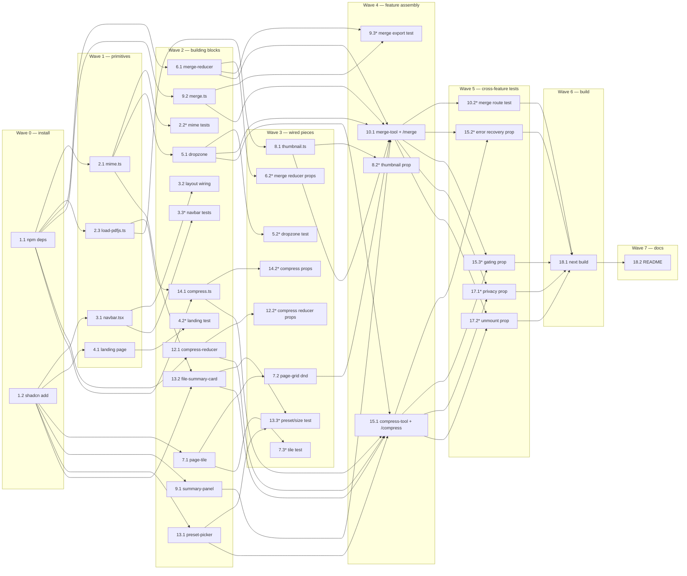

# Implementation Plan: PDF Merger & Compressor

## Overview

Work is split into nine groups that match the spec: dependencies, shared primitives, navbar, landing page, dropzone, merge, compress, cross-cutting privacy/cleanup, and verification. Reducers live in dedicated files so they can be written and tested alongside the UI that consumes them. Every optional (`*`) test task is annotated with the exact Correctness Property and Requirement numbers it validates. All files that touch `pdfjs-dist` or `pdf-lib` are client-only — no `app/api/**` routes are added.

## Tasks

### Group 1 — Dependencies

- [ ] 1. Install dependencies and add shadcn components
  - [ ] 1.1 Install runtime and dev dependencies
    - Run `npm install pdf-lib pdfjs-dist @dnd-kit/core @dnd-kit/sortable nanoid`
    - Run `npm install --save-dev fast-check vitest @testing-library/react @testing-library/dom @testing-library/jest-dom jsdom`
    - Add a `"test": "vitest --run"` script to `package.json`
    - _Requirements: 3.1, 4.1, 5.1, 9.1, 10.1_
  - [ ] 1.2 Add shadcn UI components via CLI
    - Run `npx shadcn@latest add tabs radio-group progress sonner dialog separator badge alert`
    - Verify the generated files land under `components/ui/`
    - _Requirements: 1.2, 6.4, 8.1, 9.3, 9.6_

### Group 2 — Shared primitives

- [ ] 2. Shared PDF helpers
  - [ ] 2.1 Implement `lib/pdf/mime.ts`
    - Export `isPdfFile(file)`, `formatBytes(n)`, `timestampedName(prefix)`, `stripPdfExt(name)`, `compressedFilename(name, preset)`
    - Keep every helper pure and synchronous
    - _Requirements: 3.4, 6.3, 7.4, 9.5_
  - [ ]* 2.2 Write unit and property tests for mime helpers
    - **Property 2: Only PDFs enter ingest state — validates Requirements 3.4, 7.4**
    - **Property 8: Merge filename is timestamped — validates Requirements 6.3**
    - **Property 13: Compressed filename is deterministic — validates Requirements 9.5**
    - Cover `formatBytes` boundaries (0, KB/MB/GB crossovers) with example tests
    - _Requirements: 3.4, 6.3, 7.4, 9.5_
  - [ ] 2.3 Implement `lib/pdf/load-pdfjs.ts`
    - Declare `"use client"`; cache a module-scope `Promise<typeof import("pdfjs-dist")>`
    - Set `GlobalWorkerOptions.workerSrc` via `new URL("pdfjs-dist/build/pdf.worker.min.mjs", import.meta.url).toString()` so Turbopack fingerprints the worker
    - Export `loadPdfjs()` returning the cached promise
    - _Requirements: 4.1, 9.1, 10.1, 10.3_

### Group 3 — Navbar and layout

- [ ] 3. Navbar component and layout wiring
  - [ ] 3.1 Implement `components/navbar.tsx`
    - Client component; brand `<Link href="/">onepdf</Link>` on the left, center links to `/merge` and `/compress`
    - Use Clerk `<Show when="signed-out">` for `SignInButton` + `SignUpButton`, and `<Show when="signed-in">` for `UserButton`
    - Reuse existing shadcn `Button` for sign-in/sign-up visuals
    - _Requirements: 2.2, 2.3, 2.4, 2.5, 2.6_
  - [ ] 3.2 Wire Navbar into `app/layout.tsx`
    - Remove the inline `<header>` block currently in the layout
    - Import `Navbar` from `@/components/navbar` and render it above `{children}`
    - Keep `ClerkProvider`, font variables, and the `globals.css` import untouched
    - _Requirements: 2.1, 2.6, 2.7_
  - [ ]* 3.3 Write unit tests for Navbar auth branches
    - Mock `@clerk/nextjs` to force signed-in and signed-out branches
    - Assert the correct set of controls renders for each branch
    - _Requirements: 2.2, 2.3, 2.4, 2.5_

### Group 4 — Landing page

- [ ] 4. Landing page rewrite
  - [ ] 4.1 Rewrite `app/page.tsx` as the Landing_Page
    - Delete the existing demo sign-in form entirely
    - Render a hero (title + one summary sentence) and exactly two shadcn `Card` components wrapping `next/link` anchors to `/merge` and `/compress`
    - Keep the file as a server component
    - _Requirements: 1.1, 1.2, 1.3, 1.4, 1.5_
  - [ ]* 4.2 Write unit test for landing page content
    - Assert exactly two cards render with the correct `href` values and that the previous demo form is gone
    - _Requirements: 1.2, 1.3, 1.4, 1.5_

### Group 5 — Shared dropzone

- [ ] 5. Shared dropzone component
  - [ ] 5.1 Implement `components/pdf/dropzone.tsx`
    - Client component exposing `DropzoneProps` from the design (`accept`, `multiple`, `onFiles`, `onReject`, `label`)
    - Handle `dragenter` / `dragover` / `dragleave` / `drop` plus a hidden `<input type="file">`
    - Filter candidates via `isPdfFile`; never read file contents inside the dropzone
    - _Requirements: 3.1, 7.1_
  - [ ]* 5.2 Write unit tests for dropzone filtering
    - Mixed drop → only PDFs flow through `onFiles`, non-PDFs through `onReject` with reasons
    - With `multiple={false}`, only the first PDF is emitted
    - _Requirements: 3.4, 7.3, 7.4_

### Group 6 — Merge

- [ ] 6. Merge reducer and state types
  - [ ] 6.1 Implement `components/pdf/merge-reducer.ts`
    - Define `Source`, `Page`, `MergeState`, `MergeAction`, and the `mergeReducer` exactly per the design
    - Handle `add-sources`, `reject`, `thumb-ready`, `thumb-error`, `reorder`, `delete`, `build-start`, `build-done`, `build-error`, `reset`
    - Use `arrayMove` from `@dnd-kit/sortable` for `reorder`; prune sources with zero remaining tiles on `delete`
    - Keep the reducer pure — no `URL.revokeObjectURL`, no `destroy()` calls inside it
    - _Requirements: 3.2, 3.3, 3.5, 5.1, 5.3, 5.4, 5.5, 6.1_
  - [ ]* 6.2 Write property tests for merge reducer semantics
    - **Property 1: Ingest grows the grid by the sum of page counts — validates Requirements 3.2, 3.3, 4.1**
    - **Property 3: Download-merged gate tracks page count — validates Requirements 3.5, 6.1**
    - **Property 6: Delete preserves multiset minus one and prunes unreferenced sources — validates Requirements 5.3, 5.4**
    - **Property 7: Reorder is array-move — validates Requirements 5.1, 5.2**
    - _Requirements: 3.2, 3.3, 3.5, 4.1, 5.1, 5.2, 5.3, 5.4, 6.1_

- [ ] 7. Merge grid primitives
  - [ ] 7.1 Implement `components/pdf/page-tile.tsx`
    - Render the thumbnail image, source file name, source page number, overall grid position, and a delete control
    - Show a loading placeholder while `status === "pending"` and a fallback icon for `"error"`
    - _Requirements: 4.3, 4.4, 4.5_
  - [ ] 7.2 Implement `components/pdf/page-grid.tsx` with `@dnd-kit`
    - `DndContext` with `PointerSensor` (`activationConstraint: { distance: 6 }`) and `KeyboardSensor` using `sortableKeyboardCoordinates`
    - `SortableContext` wraps the tile list with `rectSortingStrategy`
    - `onDragEnd({ active, over })` dispatches `{ type: "reorder", from, to }` resolved from `pages.findIndex`
    - _Requirements: 4.2, 5.1, 5.2_
  - [ ]* 7.3 Write unit test for PageTile content
    - **Property 5: Tile text reflects position, source, and page index — validates Requirements 4.3**
    - _Requirements: 4.3_

- [ ] 8. Merge thumbnail pipeline
  - [ ] 8.1 Implement `lib/pdf/thumbnail.ts`
    - Export `renderThumbnail(pdf, pageIndex)` producing a PNG `Blob` via `OffscreenCanvas` with an `HTMLCanvasElement` fallback
    - Call `page.cleanup()` after rendering finishes
    - _Requirements: 4.1, 4.4, 4.5, 11.1, 11.2_
  - [ ]* 8.2 Write property test for the thumbnail queue
    - **Property 21: Thumbnails emit one ready-transition per page — validates Requirements 4.4, 4.5, 11.1, 11.2**
    - Drive a stub `pdfDocument` through the queue and assert one `thumb-ready` dispatch per page with React yields between them
    - _Requirements: 4.4, 4.5, 11.1, 11.2_

- [ ] 9. Merge summary and build pipeline
  - [ ] 9.1 Implement `components/pdf/summary-panel.tsx`
    - Display source count, page count, a shadcn `Progress` bar, and a "Download merged PDF" button
    - Disable the button when `pages.length < 2` or `building === true`, with guidance text for each condition
    - _Requirements: 3.5, 6.1, 6.4, 11.4_
  - [ ] 9.2 Implement `lib/pdf/merge.ts` `buildMergedPdf`
    - Load each `Source.bytes` once with `PDFDocument.load`; iterate `pages` in order calling `copyPages` + `addPage`; save to a `Blob` with `type: "application/pdf"`
    - `await Promise.resolve()` between pages so the UI can paint
    - _Requirements: 6.2, 10.1_
  - [ ]* 9.3 Write integration test for merge export order
    - **Property 4: Grid order is the export order — validates Requirements 4.2, 5.1, 5.2, 5.5, 6.2**
    - Feed a reducer-produced `pages` array into `buildMergedPdf` and assert the output's page order matches `pages`
    - _Requirements: 4.2, 5.1, 5.2, 5.5, 6.2_

- [ ] 10. Merge route and container
  - [ ] 10.1 Create `components/pdf/merge-tool.tsx` and `app/merge/page.tsx`
    - `merge-tool.tsx` is a `"use client"` component owning `useReducer(mergeReducer, initialState)`, the thumbnail queue, and cleanup effects that call `URL.revokeObjectURL` on tile deletion and `pdfDocument.destroy()` on source removal or unmount
    - Compose `Dropzone` (`multiple: true`) + `PageGrid` + `SummaryPanel`
    - Trigger the download via an anchor with `download={timestampedName("merged")}`
    - `app/merge/page.tsx` is a `"use client"` page that mounts `<MergeTool />` and a `sonner` `<Toaster />`
    - _Requirements: 3.1, 3.2, 3.3, 3.5, 5.5, 6.2, 6.3, 6.4, 10.1, 10.3, 10.4_
  - [ ]* 10.2 Write unit test for merge gating and download filename
    - Assert the download button is disabled with `< 2` pages and enabled at `≥ 2`
    - Assert the anchor's `download` attribute matches `/^merged-\d+\.pdf$/`
    - _Requirements: 3.5, 6.1, 6.3_

- [ ] 11. Checkpoint — Merge feature
  - Ensure all tests pass, ask the user if questions arise.

### Group 7 — Compress

- [ ] 12. Compress reducer and state types
  - [ ] 12.1 Implement `components/pdf/compress-reducer.ts`
    - Define `Preset`, `CompressState`, actions (`set-source`, `set-preset`, `start`, `progress`, `done`, `error`, `reset`), and `compressReducer`
    - Default `preset` is `"medium"`; `set-preset` with a different value clears `result`
    - `set-source` resets `result`, `progress`, `ignoredExtra`, `rejectReason`, and `error`
    - _Requirements: 7.2, 7.3, 7.5, 8.1, 8.2, 8.4_
  - [ ]* 12.2 Write property tests for compress reducer
    - **Property 14: Preset invalidation — validates Requirements 8.4**
    - **Property 15: Single-preset invariant — validates Requirements 8.1, 8.2**
    - **Property 16: Compress replace resets result — validates Requirements 7.5**
    - **Property 17: Multi-drop keeps the first PDF and counts the rest — validates Requirements 7.3**
    - _Requirements: 7.3, 7.5, 8.1, 8.2, 8.4_

- [ ] 13. Compress UI primitives
  - [ ] 13.1 Implement `components/pdf/preset-picker.tsx`
    - shadcn `RadioGroup` over `"high" | "medium" | "low"` with captions that read DPI + JPEG quality from `PRESETS`
    - Emit `onChange(preset)` up to the parent reducer
    - _Requirements: 8.1, 8.2, 8.3_
  - [ ] 13.2 Implement `components/pdf/file-summary-card.tsx`
    - Show file name and original byte size via `formatBytes`
    - After compression, show compressed size, absolute delta, and percent reduction computed as `Math.round(((orig - comp) / orig) * 100)` (display `0%` or "no reduction" when `comp >= orig`)
    - Surface `ignoredExtra` and `rejectReason` with shadcn `Alert`; show the preset via `Badge`
    - _Requirements: 7.2, 7.3, 7.4, 9.4_
  - [ ]* 13.3 Write unit tests for preset picker and size report
    - Assert the default selection is Medium and that changing the selection dispatches `set-preset`
    - **Property 12: Size report matches bytes — validates Requirements 9.4**
    - _Requirements: 8.2, 9.4_

- [ ] 14. Compress pipeline
  - [ ] 14.1 Implement `lib/pdf/compress.ts` with `PRESETS` and `compressPdf`
    - Export `PRESETS` exactly as the design table (`high`/`medium`/`low` → `{ dpi, quality }`)
    - `compressPdf` renders each page at `scale = dpi / 72`, re-encodes as JPEG at the preset quality, embeds the JPEG into a new `pdf-lib` document preserving the input page's `scale = 1` width/height, calls `onProgress(i, total)` after each page, and yields with `await Promise.resolve()`
    - _Requirements: 8.3, 9.1, 9.2, 9.3, 11.3_
  - [ ]* 14.2 Write property tests for compression output
    - **Property 9: Compressed PDF preserves page count and original dimensions — validates Requirements 9.1, 9.2**
    - **Property 10: Canvas dimensions match preset DPI — validates Requirements 9.1, 8.3**
    - **Property 11: Compression emits one progress tick per page — validates Requirements 9.3, 11.3**
    - _Requirements: 8.3, 9.1, 9.2, 9.3, 11.3_

- [ ] 15. Compress route and container
  - [ ] 15.1 Create `components/pdf/compress-tool.tsx` and `app/compress/page.tsx`
    - `compress-tool.tsx` is a `"use client"` component owning `useReducer(compressReducer, initialState)`; loads the source's `pdfDocument` via `loadPdfjs`; runs `compressPdf` on action; calls `pdfDocument.destroy()` on source replacement and unmount
    - Compose `Dropzone` (`multiple: false`, pick the first PDF on multi-drop and report `ignoredExtra`), `PresetPicker`, `FileSummaryCard`, shadcn `Progress`, and the "Compress" and "Download compressed PDF" buttons
    - Download anchor uses `compressedFilename(source.name, preset)`
    - `app/compress/page.tsx` is a `"use client"` page mounting `<CompressTool />` and a `sonner` `<Toaster />`
    - _Requirements: 7.1, 7.2, 7.3, 7.5, 9.3, 9.4, 9.5, 10.1, 10.3, 10.4_
  - [ ]* 15.2 Write property test for async error recovery across both tools
    - **Property 18: Async action error recovery — validates Requirements 6.5, 9.6**
    - Force `buildMergedPdf` and `compressPdf` to throw; assert each tool dispatches an error action that clears `building`/`running`, leaves the rest of state untouched, surfaces a `sonner` toast with the error message, and re-enables the triggering button
    - _Requirements: 6.5, 9.6_
  - [ ]* 15.3 Write property test for secondary-action gating during processing
    - **Property 22: Secondary action during processing is disabled or queued — validates Requirements 11.4**
    - Exercise both `/merge` and `/compress` while `building`/`running` is true and assert secondary controls are either disabled with guidance text or queue-execute exactly once
    - _Requirements: 11.4_

- [ ] 16. Checkpoint — Compress feature
  - Ensure all tests pass, ask the user if questions arise.

### Group 8 — Cross-cutting property tests

- [ ] 17. Cross-feature privacy and cleanup tests
  - [ ]* 17.1 Write property test for outbound-bytes privacy
    - **Property 19: No PDF bytes leave the client — validates Requirements 10.1, 10.2, 10.3**
    - Spy on `fetch`, `XMLHttpRequest.prototype.send`, `Navigator.prototype.sendBeacon`, and `WebSocket.prototype.send`; drive both merge and compress pipelines end-to-end and assert no call body contains any tracked source `ArrayBuffer` or produced output `Blob` bytes
    - _Requirements: 10.1, 10.2, 10.3_
  - [ ]* 17.2 Write property test for unmount cleanup
    - **Property 20: Unmount releases resources — validates Requirements 10.4**
    - Mount each tool with at least one source, call `unmount()`, and assert `URL.revokeObjectURL` was invoked exactly once per non-null `thumbUrl` and `pdfDocument.destroy` exactly once per source
    - _Requirements: 10.4_

### Group 9 — Verification

- [ ] 18. Build verification and README
  - [ ] 18.1 Run `npm run build` and resolve any errors
    - Fix type / lint issues introduced by the feature; re-run until the build is clean
    - _Requirements: 10.3_
  - [ ] 18.2 Update `README.md`
    - Document the `/merge` and `/compress` routes, the client-side processing guarantee, and the compression preset table (DPI + JPEG quality)
    - _Requirements: 1.1, 8.3, 10.1_

- [ ] 19. Final checkpoint — full build green
  - Ensure all tests pass, ask the user if questions arise.

## Notes

- Sub-tasks marked with `*` are optional property / unit / integration tests. They can be skipped for a faster MVP but should be filled in before release.
- Reducers live in dedicated files so they can be implemented and tested in parallel with the UI that consumes them.
- Every file importing `pdfjs-dist` or `pdf-lib` is client-only (per the design's Client Boundary Enforcement). No `app/api/**` routes are added.
- Each property test imports its exact property text from a shared constants module so the tag and the assertion stay in lockstep.

## Task Dependency Graph

```json
{
  "waves": [
    { "id": 0, "tasks": ["1.1", "1.2"] },
    { "id": 1, "tasks": ["2.1", "2.3", "3.1", "4.1"] },
    { "id": 2, "tasks": ["2.2", "3.2", "3.3", "4.2", "5.1", "6.1", "7.1", "9.1", "9.2", "12.1", "13.1", "13.2", "14.1"] },
    { "id": 3, "tasks": ["5.2", "6.2", "7.2", "7.3", "8.1", "12.2", "13.3", "14.2"] },
    { "id": 4, "tasks": ["8.2", "9.3", "10.1", "15.1"] },
    { "id": 5, "tasks": ["10.2", "15.2", "15.3", "17.1", "17.2"] },
    { "id": 6, "tasks": ["18.1"] },
    { "id": 7, "tasks": ["18.2"] }
  ]
}
```


